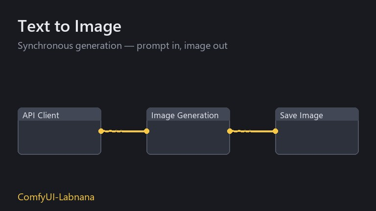
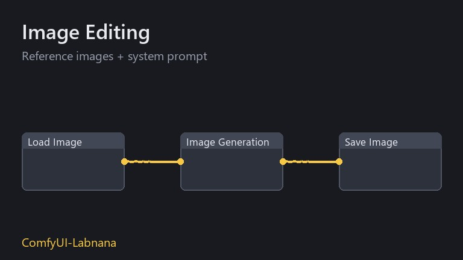
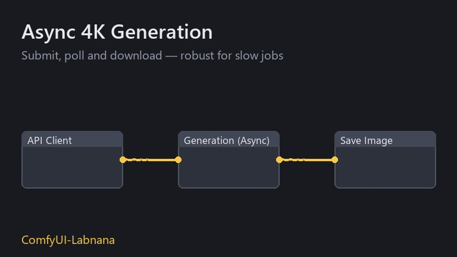
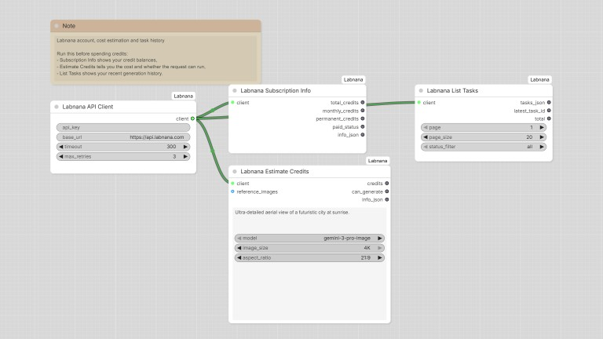

# ComfyUI-Labnana

[](https://github.com/exoticknight/ComfyUI-Labnana/actions/workflows/ci.yml)
[](LICENSE)
[](pyproject.toml)

中文文档 | [English](README.md)

Labnana(火星电波)图像生成 API 的 ComfyUI 自定义节点集。一个生图节点搞定文生图、改图和 4K 输出——提交、等待、下载全部在节点内部完成;另附成本控制与任务历史工具。

- 接入文档:<https://labnana.com/docs/openapi/guide>
- 完整 API 参考:<https://docs.marswave.ai/openapi-labnana.html>

## 安装

**通过 ComfyUI-Manager**(推荐):打开 **Manager → Custom Nodes Manager → Install via Git URL**,粘贴:

```
https://github.com/exoticknight/ComfyUI-Labnana
```

**手动安装**:

```
cd ComfyUI/custom_nodes
git clone https://github.com/exoticknight/ComfyUI-Labnana.git
```

仅依赖 `requests`(ComfyUI 自带)。重启 ComfyUI 后,节点位于 **Labnana** 分类下。

## API Key

在 <https://labnana.com/api-keys> 创建 Key(`ls_` 开头),二选一:

1. 填入 **Labnana API Client** 节点的 `api_key` 字段;
2. 设置环境变量 `LABNANA_API_KEY`(字段留空时自动读取,推荐,避免 Key 随工作流文件泄露)。

## 快速上手:文生图

`Labnana API Client` → `Labnana Image Generation` → `Save Image`。写好 prompt,选 `model`、`image_size`、`aspect_ratio`,点 Run,其余节点内部自动处理。

- `provider` 由所选模型自动推导,无需手选。
- `image_urls` 输出结果的公开 URL(7 天有效)。
- `seed` 参数不会发送给 API,仅用于让 ComfyUI 重新执行节点(否则相同参数会命中缓存直接返回上次结果);设为 randomize 即每次都重新生成。

## 改图(图生图)

把 `Load Image` 接到 `reference_images`,prompt 里写编辑指令即可。参考图有两种来源,可混用,总数受模型上限(4–14)约束:

- `reference_images`(IMAGE 输入):ComfyUI 图像批次,自动编码为 base64 内联上传(过大自动缩到 3072px 内 / 转 JPEG,规避 20MB 请求体上限);
- `reference_image_urls`(文本):每行一个 `https://` 或 `gs://` URL。

**风格预设**:所有生成类节点都有可选的 `system_prompt` 输入,发送时拼接在 prompt 前(API 无原生 system prompt 字段),方便在多个工作流间复用同一段风格/行为约束。

## 4K 与慢任务

不需要任何特殊接法——`image_size` 选 `4K` 就行。默认最多等 10 分钟,更慢的任务调大节点的可选 `timeout` 输入即可。

## 成本控制

- **Labnana Estimate Credits**:输入与生图节点一致,返回 `credits` 与 `can_generate`——生成前先看价格;
- **Labnana Subscription Info**:查询额度余额与订阅状态;
- 不合法组合(如 wan2.7-image 选 4K、参考图超上限)会在发请求前直接报错,不浪费额度。

## 模型与限制

| 模型 | provider | 尺寸 | 参考图上限 | 额度 (1K/2K/4K) |
|---|---|---|---|---|
| gemini-3-pro-image | google | 1K/2K/4K | 14 | 15/15/30 |
| gemini-3.1-flash-image | google | 1K/2K/4K | 14 | 10/10/20 |
| gpt-image-2 | openai | 1K/2K/4K | 4 | 4/6/10 |
| wan2.7-image-pro | alibaba | 1K/2K/4K | 9 | 6/8/12 |
| wan2.7-image | alibaba | 1K/2K | 9 | 4/6 |
| seedream-5-0-pro | bytedance | 1K/2K | 10 | 6/15 |

宽高比:`1:1, 2:3, 3:2, 3:4, 4:3, 9:16, 16:9, 21:9, 1:4, 4:1, 1:8, 8:1`。

额度价格以[官方文档](https://docs.marswave.ai/openapi-labnana.html)为准,可能调整——**Estimate Credits** 节点返回的永远是实时价格。

## 高级:任务管理

面向批量流水线和「先提交、以后再取」的场景,异步任务接口以节点形式放在 **Labnana/Advanced** 分类下:

- **Labnana Submit Task** — 只提交、立即返回 `task_id`,不等待;
- **Labnana Get Task** — 之后任意时刻按 `task_id` 查询/等待任务并下载图片;
- **Labnana List Tasks** — 分页浏览任务历史,可按状态过滤;
- **Labnana Load Image From URL** — 把结果 URL(或任意图片 URL)加载为 IMAGE。

日常使用不需要它们——`Labnana Image Generation` 一个节点就完成了提交+等待+下载。

## 示例工作流

[example_workflows/](example_workflows) 内置四个开箱即用的工作流,会出现在 ComfyUI 的 **Workflow → Browse Templates → ComfyUI-Labnana** 模板浏览器中(也可直接把 JSON 拖到画布上):

|  |  |
|:---:|:---:|
| **Text to Image** — 最简生图 | **Image Editing** — 参考图 + `system_prompt` 风格约束 |
|  |  |
| **4K Generation** — 高分辨率 + 更长超时 | **Account & Costs** — 生成前查余额、预估积分、看任务历史 |

## 错误处理

| code | 含义 | 处理 |
|---|---|---|
| 21007 | API Key 无效 | 检查 Key 配置 |
| 26004 | 额度不足 | 充值 / 升级订阅 |
| 29003 | 参数错误 | 检查模型与参数组合 |
| 29998 | 触发限流 | 客户端已按文档以 20–30s 指数退避自动重试(免费额度高峰期会被限流) |

所有 API 错误都会附带错误码与处理建议抛出,显示在 ComfyUI 的报错弹窗与日志中。

## 开发

离线测试(无需 API Key 和网络,需要 torch/Pillow/numpy):

```
python tests/test_offline.py
```

<details>
<summary><b>节点 → API 接口对照</b></summary>

| 节点 | 接口 |
|---|---|
| Labnana Subscription Info | `GET /openapi/v1/user/subscription` |
| Labnana Image Generation | `POST /openapi/v1/images/generation/async` + `GET .../tasks/{taskId}` 轮询 |
| Labnana Estimate Credits | `POST /openapi/v1/images/generation/estimate-credits` |
| Labnana Submit Task | `POST /openapi/v1/images/generation/async` |
| Labnana Get Task | `GET /openapi/v1/images/generation/tasks/{taskId}` |
| Labnana List Tasks | `GET /openapi/v1/images/generation/tasks` |

同步接口(`POST /openapi/v1/images/generation`)在内置的 `labnana_api` 客户端库中有实现,但不作为节点暴露——异步流程对任何尺寸都更稳。

</details>

## License

[Apache-2.0](LICENSE)
